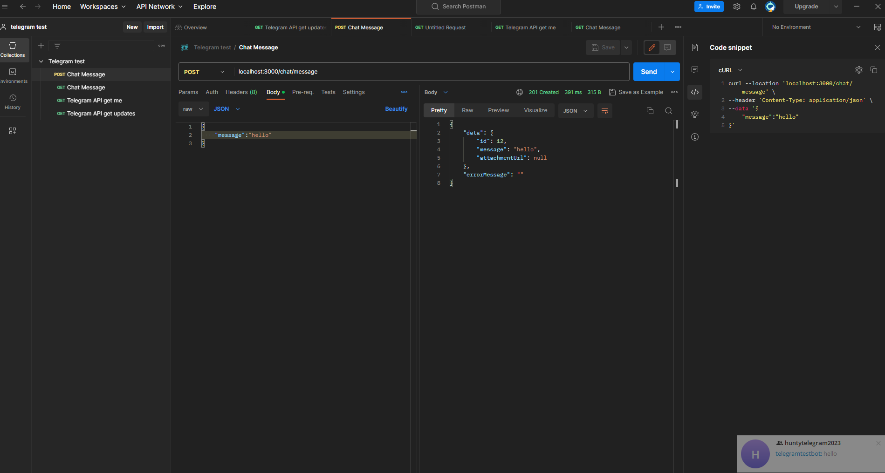
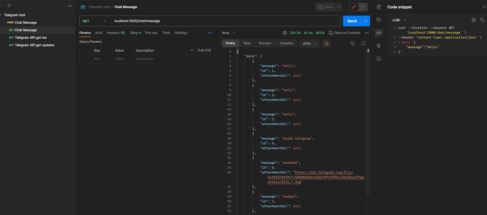

# Telegram test

## How run

---

## Getting started

These instructions will get you a copy of the project up and running on your local machine for development and testing purposes.

### Prerequisites

What things you need to install the software and how to install them :

- [Git](https://git-scm.com/)
- [Node.js](https://nodejs.org/)
- [Docker](https://docs.docker.com/docker-for-windows/install/) or [Docker Toolbox](https://github.com/docker/toolbox/releases)
- [Nest CLI](https://docs.nestjs.com/cli/overview)
- create bot https://core.telegram.org/bots/features#botfather
- config bot in your group https://stackoverflow.com/a/46247058
- disable privacy mode to listen message https://stackoverflow.com/a/45441585
---

### Installation

1. Clone the git repository

   ```bash
   git clone https://github.com/ahelord/telegram-test.git
   ```

1. Go into the project directory

   ```bash
   cd telegram-test/
   ```

1. Checkout working branch

   ```bash
   git checkout main
   ```

1. Install NPM dependencies

   ```bash
   npm i
   ```

1. Copy `.env.dist` to `.env` 

   ```bash
   cp .env-example .env
   ```

1. Replace the values of the variables with your own and add Telegram env vars: TELEGRAM_CHAT_ID and TELEGRAM_BOT_TOKEN

1. Create Docker images and launch them

   ```bash
   docker-compose up -d --build
   ```

---


### Docker Compose

**Compose file**: [`docker-compose.yml`](https://github.com/smarlhens/nest7-boilerplate/blob/master/docker-compose.yml).

Containers :

- PostgreSQL 14
- pgAdmin 6

Compose file uses `.env`.

---

### ESLint

[ESLint](https://eslint.org/) is a fully pluggable tool for identifying and reporting on patterns in JavaScript.

**Configuration file**: [`.eslintrc.js`](https://github.com/smarlhens/nest7-boilerplate/blob/master/.eslintrc.js).

For more configuration options and details, see the [configuration docs](https://eslint.org/docs/user-guide/configuring).


## Running the app

### run migrations

```bash
npm run typeorm:migration:run
```

### development

```bash
npm run start
```

### watch mode

```bash
npm run start:dev
```

### production mode

```bash
npm run start:prod
```

---

## Code scaffolding

Run `nest generate|g <schematic> <name> [options]` to generate a new Nest Element.

---

## Further help

To get more help on the Nest CLI use `nest --help` or go check out the [Nest CLI README](https://github.com/nestjs/nest-cli/blob/master/README.md).


## Build

Run `npm run build` to build the project. The build artifacts will be stored in the `dist/` directory.

---

## Test

### unit tests

```bash
npm run test:watch
```


## Call endpoints

```
curl --location 'localhost:3000/chat/message' \
--header 'Content-Type: application/json' \
--data '{
    "message":"hello"
}'
```

```
curl --location 'localhost:3000/chat/message'

```


